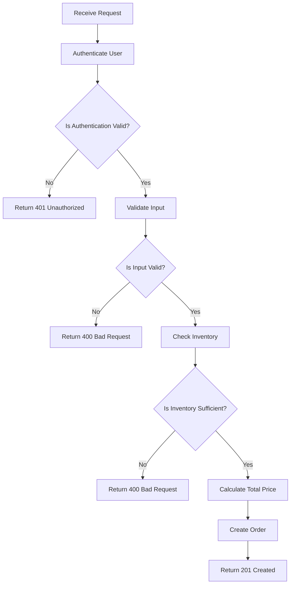

# Specification:: Create a new order
* API Specification for creating a new order in an e-commerce system.
* Database schema design for orders, customers, products, and order line items.
* Error handling and response structure for the API endpoint.
* Example request and response payloads for the create order API.
* Input validation rules for the API request body.
* Authentication and authorization requirements for accessing the API endpoint.
* Business flow and rules for processing a new order, including inventory checks and payment processing (if applicable).

## API Specification

### Request Specification
* POST /api/v1/orders
* Headers:
  * Content-Type: application/json
  * Accept: application/json
  * Authorization: Bearer <token> (authentication is required)
* Request body
```
{
  "customerId": "unique-customer-id-123",
  "orderDate": "2025-01-20T23:24:00Z",
  "lineItems": [
    {
      "productId": "product-id-abc",
      "quantity": 2,
      "unitPrice": 10.50
    },
    {
      "productId": "product-id-xyz",
      "quantity": 1,
      "unitPrice": 25.00
    }
  ],
  "shippingAddress": {
    "street": "123 Main St",
    "city": "Anytown",
    "state": "CA",
    "zipCode": "12345"
  },
  "billingAddress": {
    "street": "123 Main St",
    "city": "Anytown",
    "state": "CA",
    "zipCode": "12345"
  }
}
```

### Response Specification
* Success Status Code: 201 Created
  * Content-Type: application/json
```
{
  "orderId": "order-id-999",
  "customerId": "unique-customer-id-123",
  "status": "pending",
  "totalPrice": 46.00,
  "orderDate": "2025-01-20T23:24:00Z",
  "lineItems": [
    // ... same line items as request, potentially with added IDs ...
  ],
  "links": [
    {
      "rel": "self",
      "href": "https://api.example.com/api/v1/orders/999"
    }
  ]
}
```
* Error Status Codes
  * 400 Bad Request: If the request body is invalid or malformed.
  * 401 Unauthorized: If authentication fails or is missing.
  * 403 Forbidden: If the user lacks permission to create an order.
  * 404 Not Found: If a referenced resource (e.g., a productId or customerId) does not exist.
  * 429 Too Many Requests: If rate limits are exceeded.
  * 500 Internal Server Error: For unexpected server-side issues. 

# Input Validation Rules

| Field | Rules |
|-------|-------|
| `customerId` | Valid UUID format; must correspond to an existing customer in the database |
| `orderDate` | Valid ISO 8601 date-time string; cannot be in the future |
| `lineItems` | Non-empty array; each item requires: |
| `lineItems[].productId` | Valid UUID format; must correspond to an existing product in the database |
| `lineItems[].quantity` | Positive integer greater than zero |
| `lineItems[].unitPrice` | Positive decimal number with exactly two decimal places |
| `shippingAddress` | All fields required: `street`, `city`, `state`, `zipCode`; each must be non-empty string |
| `billingAddress` | All fields required: `street`, `city`, `state`, `zipCode`; each must be non-empty string |

## Business Flow and Rules
1. **Receive Request**: The API endpoint receives a POST request to create a new order.
2. **Authenticate User**: If authentication is required, validate the provided token and ensure the user has permission to create an order.
3. **Validate Input**: Validate the request body against the defined input validation rules. If validation fails, return a 400 Bad Request with details about the validation errors.
4. **Check Inventory**: For each line item, check if the requested quantity of the product is available in inventory. If any product is out of stock, return a 400 Bad Request with an appropriate error message.
5. **Calculate Total Price**: Calculate the total price for the order by summing the product of quantity and unit price for each line item.
6. **Create Order**: If all validations pass and inventory is sufficient, create a new order record in the database, along with associated line items and addresses.
7. **Return Response**: Return a 201 Created response with the order details, including a unique order ID and a link to retrieve the order.

Mermaid diagram for business flow



## Database diagram for order 
* DBML (Database Markup Language)
  * https://dbdiagram.io/
```
Table customers {
  id bigint [pk, increment, note: 'generated always as identity']
  unique_id text [unique, not null]
}

Table orders {
  id bigint [pk, increment, note: 'generated always as identity']
  customer_id bigint [not null]
  order_date timestamptz [not null]
  shipping_street text [not null]
  shipping_city text [not null]
  shipping_state text [not null]
  shipping_zip_code text [not null]
  billing_street text [not null]
  billing_city text [not null]
  billing_state text [not null]
  billing_zip_code text [not null]
  status text [not null]
}

Table products {
  id bigint [pk, increment, note: 'generated always as identity']
  unique_id text [unique, not null]
}

Table order_line_items {
  id bigint [pk, increment, note: 'generated always as identity']
  order_id bigint [not null]
  product_id bigint [not null]
  quantity int [not null]
  unit_price "numeric(10, 2)" [not null]
}

// Relationships (Foreign Keys)
Ref: orders.customer_id > customers.id
Ref: order_line_items.order_id > orders.id
Ref: order_line_items.product_id > products.id
```

Database descriptions
* Customers: Stores customer information with a unique identifier.
* Orders: Contains order details, including customer reference and shipping/billing addresses.
* Products: Holds product information with a unique identifier.
* Order Line Items: Records each product in an order, including quantity and unit price.